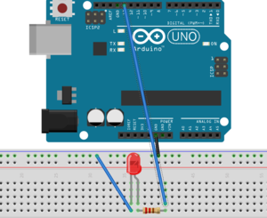
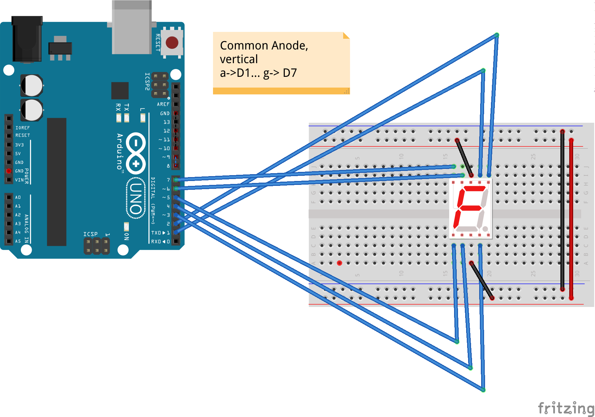

# Experimental Platform description

## Pre-installation (Arduino stuff)

  * You may have to install the following (Linux) packages: `arduino` ,
`gcc-avr` and `avrdude` (`avr-binutils` et `avr-libc` if they are not included)
  * `avrdude.conf` must be in `/usr/share/arduino/hardware/tools/` (if not you have to modify Makefiles).
  * The user should have the right to write on  the USB port :
`usermod -aG dialout <username>`

## Pre-install (other)

  * Lustre will be installed with the help of a script
  * Other (Linux) packages: `maven` (`antlr4` will be automatically
  downloaded)
  * Java 8 (openjdk)

### Some Arduino general information

Arduino/Genuino cards are free cards build around a Atmel AVR
microntroler. In this lab we will use  Arduino UNOs (atmega328p) like
in the following picture. The platform has a few numerical and
analogic I/Os where we will connect LEDs, buttons, seven segment led
displays...

The microcontroler itself is programmed with a bootloader so that a dedicated
system is not necessary. The Makefile we give you will use   `avrdude`
[doc](http://www.nongnu.org/avrdude/) to load the binaries into the
microcontroler memory.

You will be given a whole platform with an arduino UNO, some leds, a
breadboard, wires ...  **You will be responsible for them for the
duration of the lab** On the breadboards, all points in a given
supply line (blue/black, read) are connected. Same for the columns.

## Example Applications

### Switch the light on!

The led changes its state (on/off) every time the button is pressed.

* Led on digital 13 with 220 ohm resistor. (long leg to digital 13)
* Button on digital 10, and 220 ohm resistor.

### Count to 9

The seven segment display numbers from 0 to 9 then 0, and so one, with a frequency of 1Hz. Of the user
press the button, then it resets and continue to count from 0.

#### Arduino/7seg

* The seven segment displays can be "common cathode" or "common anode"
  (vertical common anode for us!)

* 7 segment : a on digital 1 via resistor 220 ohm, b on digital 2, ...
  g on digital 7, according to the preceding numbering. For instance,
  for out setting (common anode, vertical):

**Warning, the 7 segment displays should be connected though resistors
(from 220 to 400 ohm)**
